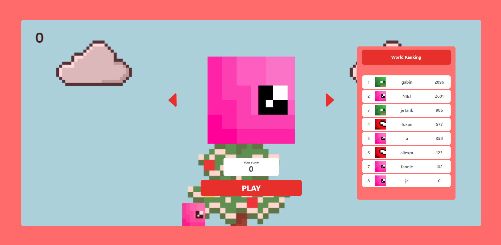
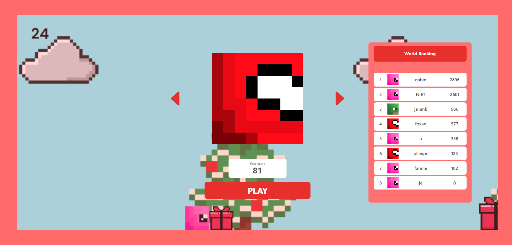

# Infinite Runner Game Project

This GitHub repository contains the source code and documentation for the development of an infinite runner game, featuring a multiplayer scoring system and a skin customization system. The project was built using the following technologies: React-JS, Node-JS, sockets with client-side extrapolation, JWT tokens for security, HTML5 Canvas for the game platform and animation, Tailwind CSS combined with vanilla CSS for styling, and lastly, a PostgreSQL database hosted on Neon and connected via Prisma.

## Features

### Front-end

Interactive user interface with React-JS.
Skin customization for a unique user experience.
Smooth and responsive animation using HTML5 Canvas.

### Back-end

Multiplayer scoring system.
Server-side game logic integrating sockets with client-side extrapolation.
Security ensured through JWT token implementation.

### Style

Utilization of Tailwind CSS for quick and efficient styling.
Supplementary styling with vanilla CSS for in-depth customization.

### Deployment

Deployment of the Node.js server on Digital Ocean for optimal performance.
Front-end hosted on Vercel for maximum availability.

### Database

Configuration of PostgreSQL database on Neon.
Connection with Prisma for simplified query and migration management.

